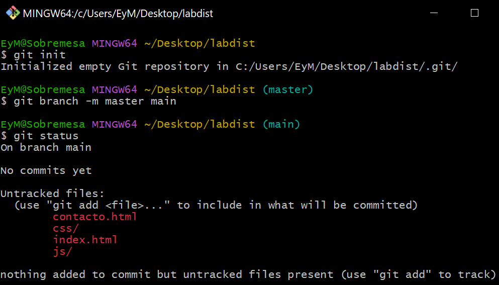
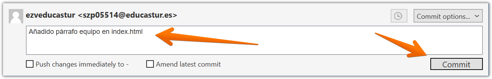
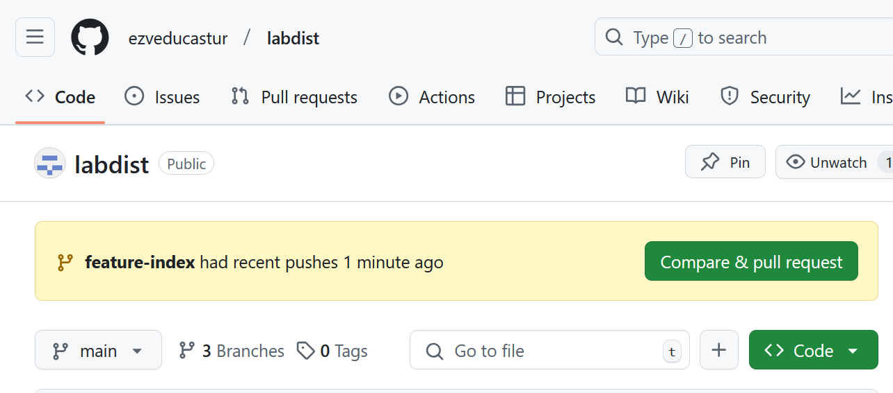
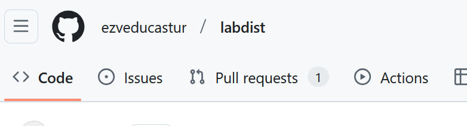

<div style="text-align: center;">
    <h1>Actividad Evaluable 2</h1><br>
    <h2>Control de versiones</h2><br>
    <h3>Despliegue de Aplicaciones Web - DAW Distancia<br>
    CIFP Sect. Industrial y Servicios - La Laboral<br>
    Curso 2024-2025<br>
    08 de febrero de 2025<br>
    Emilio Zaera Vidal - 46.911.234-C</h3>
</div>


<div style="page-break-after: always;"></div>
> Autor: **Emilio Zaera Vidal** 
>
> fecha: 08 del 02 de 2025
[TOC]

## 1. Objetivo

La actividad tiene como propósito adquirir experiencia práctica en el uso de Git para el control de versiones en un entorno de desarrollo. A través de la resolución de ejercicios, se busca que el alumno aprenda a trabajar tanto en local como en remoto, utilizando herramientas como la línea de comandos y *SourceTree*, además de gestionar ramas, resolver conflictos y documentar correctamente su flujo de trabajo.

---

---


## 2. Metodología

La tarea se divide en varios apartados. Primero, se realizan operaciones básicas en un repositorio Git local, incluyendo la inicialización, creación de ramas, commits y fusiones. Luego, se trabaja con un repositorio remoto en GitHub a través de SourceTree, subiendo cambios y sincronizando ramas. También se abordan la gestión de conflictos y la subida de documentación al repositorio. Finalmente, se requiere la entrega de un informe en PDF con capturas de pantalla y un videoclip demostrativo que evidencie el desarrollo de la actividad y la identidad del estudiante.

---

---


## 3. Trabajo en local

> Esta parte se resolverá con comandos.

Antes de comenzar el trabajo, escribo este comando para que el historial de ramas de Git se mantenga como un árbol: 

```bash
$ git config --global merge.ff false
```


---


### Cuestión 1

**Enunciado**

Inicializa un nuevo repositorio Git en una carpeta llamada `"labdist"` y agrega los archivos proporcionados  en el aula virtual. Renombra la rama master a `main` , si es necesario. Realiza el primer commit. Muestra el log del repositorio.

**Bloques de código y capturas de pantalla**

```bash
git init
git branch -m master main
git add .
git commit -m "Archivos agregados y renombrado master -> main"
git log
```




---


### Cuestión 2

**Enunciado**

Incluye un fichero `.gitignore` para que los ficheros README.md , LICENCE.txt y passwords.txt sean ignorados por el control de versiones. Realiza el commit y muestra los logs del repositorio en una línea.

**Bloques de código y capturas de pantalla**


```bash
git add .
git commit -m "Incluido fichero .gitignore"
git log --oneline
git diff head~1..head
```


---


### Cuestión 3

**Enunciado**

En el repositorio, crea los archivos `README.md` , `LICENCE.txt` y `passwords.txt` con algún contenido. Muestra el estado del repositorio. Muestra el listado de archivos ignorados.

**Bloques de código y capturas de pantalla**


```bash
git status
```


> No hay nada pendiente de añadir al staging area porque esos ficheros son ignorados


```
git status --ignored
```


---


### Cuestión 4

**Enunciado**

Crea una rama `feature-estilos`. Cámbiate a ella.

- Modifica el archivo `estilos.css`:

  - propiedad color del `body` y de `h2`: `#2a2a2a`

  - propiedad `background-color` de `header` y `footer`: `#2a75ff`

- Comprueba el estado del repositorio. Añade los cambios, realiza un commit con el mensaje "actualizados estilos a azules".

**Bloques de código y capturas de pantalla**

```bash
git branch feature-estilos
git checkout feature-estilos
git status
git add .
git commit -m "actualizados estilos a azules"
```


---


### Cuestión 5

**Enunciado**

Vuelve a la rama `main` . En el archivo `index.html` añade un comentario donde se indique tu nombre como autor de la página. Comprueba el estado del repositorio. Añade los cambios, realiza un commit con el mensaje 'añadido autor en index'. Muestra los logs del repositorio en una línea, gráficamente y con 'decoración'.

**Bloques de código y capturas de pantalla**

```bash
git checkout main
```


```
git status
git add .
git commit -m "añadido autor en index"
git log --graph -oneline --decorate
```


---


### Cuestión 6

**Enunciado**

Fusiona la rama `feature-estilos` en la rama `main`. Muestra los logs del repositorio en una línea, gráficamente y con 'decoración'

**Bloques de código y capturas de pantalla**

```bash
git status
git merge feature-estilos
git log --graph --oneline --decorate
```


---

---


## 4. Trabajo en remoto

### Cuestión 1

**Enunciado**

Continúa con el repositorio `labdist` . Añade el repositorio a ***Sourcetree***.  

**Bloques de código y capturas de pantalla**


---


### Cuestión 2

**Enunciado**

En tu cuenta de GitHub, crea un repositorio remoto y sube al remoto los ficheros de tu repositorio local. Debes subir todas las ramas. Muestra, además, la captura de pantalla donde se vean en GitHub.

**Capturas de pantalla**


En *SourceTree* añado el remoto:


Subo (push) todas las ramas al remoto:


---


### Cuestión 3

**Enunciado**

En el repositorio **local**, crea una rama `feature-index` . Añade el siguiente código dentro de la `<section class="about">` .

```html
<h2>Conoce a Nuestro Equipo</h2>
<p>
    labdist está formado por un equipo de diseñadores y
    desarrolladores apasionados que trabajan juntos para ofrecer soluciones
	tecnológicas de alta calidad. Cada miembro de nuestro equipo aporta
	experiencia en diseño, programación, y soporte técnico, asegurando que
	nuestros clientes reciban un servicio completo y personalizado.
<p>
<p>
    Nuestro objetivo es que cada cliente se sienta acompañado en su
	aventura digital, con un equipo profesional que entiende sus necesidades y
	trabaja para hacer crecer su presencia en línea.
</p>
```

Añade los cambios y crea un commit con el mensaje "Añadido párrafo equipo en index.html". Sube los cambios al remoto. (Recuerda que debes usar SourceTree en todo este apartado).

**Capturas de pantalla**

Pincho en el icono Branch:


Le doy un nombre a la nueva rama y pincho en Create Branch:


Puedo ver la nueva rama:


Agrego código a `index.html`:


Añado los cambios al staging area:


Para hacer el commit pincho en su icono:


Añado el comentario y pulso el botón "Commit".



Veo el resultado:


Subo los cambios al remoto (push):


En GitHub veo lo siguiente:



---


### Cuestión 4

**Enunciado**

En el repositorio local, fusiona la rama `feature-index` en la rama `main` .  

**Capturas de pantalla**

Primero me coloco en la rama `main`:


Selecciono la rama `main` botón derecho en la rama `feature-index` y pulso sobre merge


---


### Cuestión 5

**Enunciado**

Edita el fichero `contacto.html`. Borra unas líneas. Muestra los ficheros con cambios pendientes y las diferencias. Añade los cambios y haz un commit.

**Capturas de pantalla**

Muestro los ficheros con cambios pendientes y las diferencias:


Añado los cambios:


Hago el commit:


---


### Cuestión 6

**Enunciado**

Te das cuenta del error. Deshaz TOTALMENTE el commit anterior. Captura el estado actual del repositorio. (Asegúrate de que el fichero contacto.html ha recuperado todas las líneas borradas y no hay cambios pendientes en el repositorio.)

**Capturas de pantalla**


Hago hard reset:


No hay cambios pendientes:


El fichero `index.html` vuelve a tener el `footer`:


---


### Cuestión 7

**Enunciado**

Crea una rama `feature-mapa` y cámbiate a ella. Incluye este código en el archivo `contacto.html`:

```html
<section class="map">
	<h2>Nuestra Ubicación</h2>
	<p>C/Luis Moya 335, Gijón, Asturias</p>
	<iframe src="https://www.google.com/maps?
			q=C%2FLuis%20Moya%20335%2C%20Gij%C3%B3n%2C%20Asturias&output=embed"
			width="600" height="450" style="border:0;" allowfullscreen=""
			loading="lazy">
    </iframe>
</section>
```

 Añade los cambios. Realiza un commit.

**Capturas de pantalla**

Creo la rama y me cambio a ella:


Incluyo el código:


Añado los cambios:


Realizo el commit: 


Veo el resultado:


---


### Cuestión 8

**Enunciado**

Sube los cambios al remoto - los de todas las ramas. Muestra en el remoto los cambios del archivo `contacto.html` en la rama `feature-mapa`.

**Capturas de pantalla**

Subo los cambios al remoto (push):


Muestro en el remoto los cambios:


---


### Cuestión 9

**Enunciado**

En GitHub, en la rama `main` , fusiona la rama `feature-mapa`. Baja los cambios del remoto a local. Deja los dos repositorios sincronizados. Muestra una captura de pantalla donde se vea la página principal de tu repositorio remoto.

**Capturas de pantalla**

> haré un Pull Request simulando una revisión del código antes de fusionarlo.
>
> Podría hacerse alternativamente de manera manual desde la pestaña "Branches"


Me aparece una notificación de 1 Pull request pendiente:



Pulso en Merge y confirmo:


Hago un pull  para tenerlo en el repo local y verlo en *SourceTree*:


---

---


## 5. Conflictos

### Cuestión 1

**Enunciado**

Crea una rama `hotfix-js` . Cámbiate a ella. Añade este código en el fichero `script.js`:

```javascript
if (mensaje.value.trim() === "") {
	alert("Por favor, ingrese un mensaje.");
	valid = false;
}
```

Confirma el cambio y haz un commit con el mensaje "corregido problema en script.js". *(Fíjate en los números de línea de tu editor...)*

**Capturas de pantalla**

Creo la rama nueva:


Modifico el código en VSC:


Añado los cambios:


Hago el commit con mensaje:


---


### Cuestión 2

**Enunciado**

Vuelve a la rama `main`. En el fichero `script.js` en las mismas líneas que en la cuestión anterior, añade el código siguiente:

```javascript
if (mensaje.value.trim() === "") {
	alert("Ingrese un mensaje, por favor");
	valid = false;
}
```

Confirma el cambio y haz un commit con el mensaje "corregido problema en script.js rama main".  

**Capturas de pantalla**

Añado el cambio:


Hago commit:


---


### Cuestión 3

**Enunciado**

Fusiona la rama `hotfix-js` en `main`. Debe producirse un conflicto. Resuélvelo como consideres oportuno. Cuando termines la resolución del conflicto sube los cambios al remoto.

**Capturas de pantalla**

Intento el merge de `hotfix-js` en `main`

> Obsérvese que tengo que tener la rama main seleccionada (doble clic, paso 1)


Me aparece el mensaje de **conflicto**:


> Mientras no resuelva el conflicto aparece Uncommitted changes


Voy a resolver usando de manera manual, en Notepad++:


Manualmente lo dejo así:


Guardo y cierro el fichero y vuelvo a *SourceTree* , donde selecciono "Marcar como resuelto":


A continuación hago el commit para registrar los cambios y los subo al remoto:


Historial resultado:


---

---


## 6. URL de mi repo en GitHub

https://github.com/ezveducastur/labdist

---

---


## 7. URL de mi videoclip

https://emiliozv.synology.me:5001/d/s/1261i8bARz0nYBTcmqXisnELR6q7GXcr/QVpsYUu-S0p9xiKCHLTPbxiudOhOjtJE-_bvgbFGnCgw
